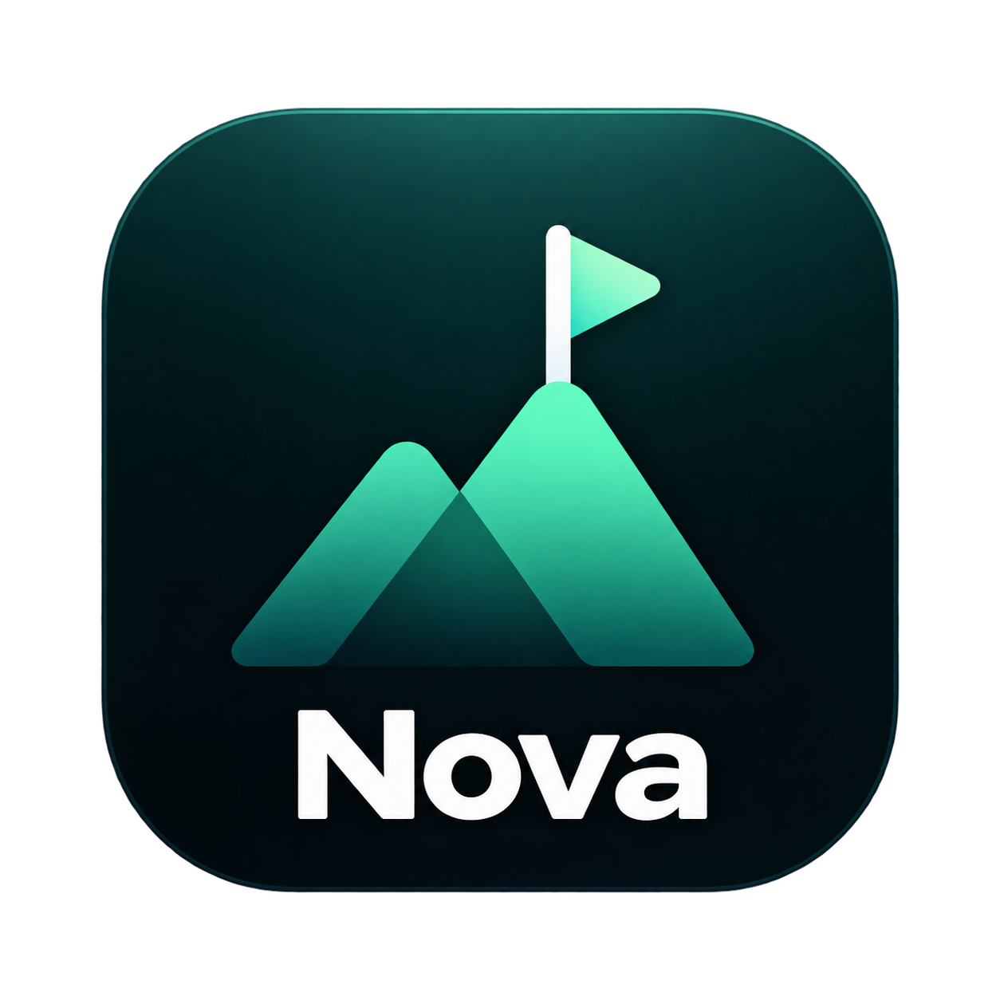
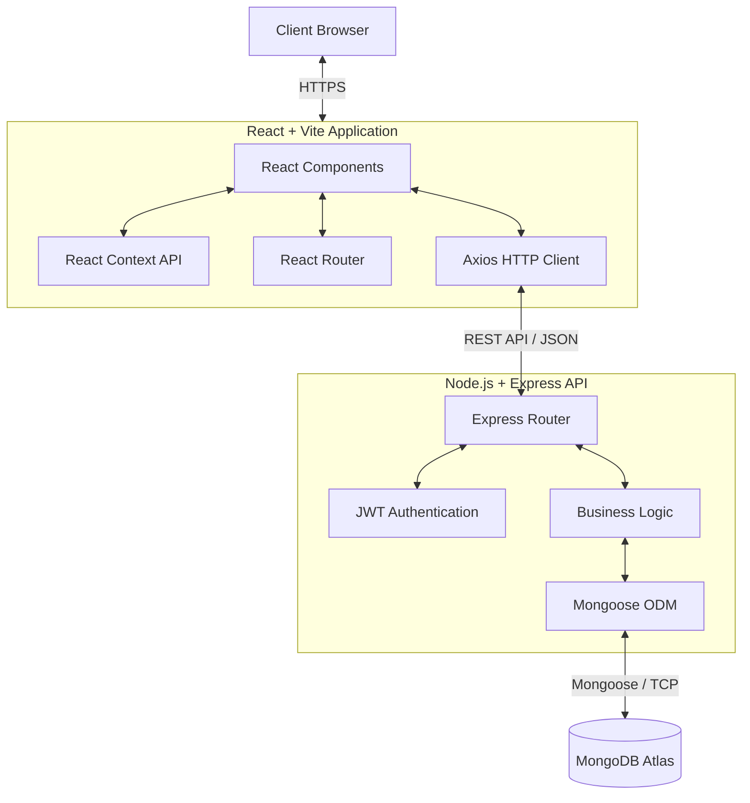
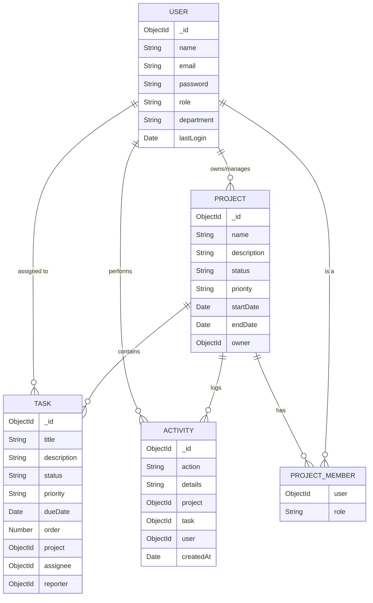

<div align="center">
  
  <h1>NOVA — Team Productivity Platform</h1>
  <p><strong>Plan. Collaborate. Deliver.</strong></p>
  <p>NOVA is a premium, full-stack project management application featuring real-time task tracking, interactive Kanban boards, and comprehensive team analytics.</p>

  <div>
    
    
    
    
    
  </div>
</div>

<br />

> **Live Demo:** [https://nova-backend-evhs.onrender.com](https://nova-backend-evhs.onrender.com) (Backend API)  
> *Note: Frontend deployment URL goes here*

---

## 🏗️ System Architecture

NOVA follows a modern **Client-Server architecture** with a decoupled frontend and backend, communicating securely via RESTful APIs and JSON Web Tokens.



---

## 🗄️ Entity Relationship Diagram

The database is built on MongoDB using Mongoose schemas. Below is the relational structure of the documents:



---

## ✨ Key Features

### 🔐 Security & Authentication
- **JWT-based authentication** (Login/Register)
- **Protected routes** with automatic token validation
- **Password encryption** using bcrypt

### 📊 Interactive Dashboard
- **Real-time stats** (active projects, tasks, completion rates, overdue tasks)
- **Dynamic charts** via Chart.js (weekly progress, status distribution)
- **Live activity feed** tracking team actions (task moves, comments, creations)

### 📋 Kanban Board & Tasks
- **Smooth Drag-and-Drop** task cards between columns
- **Visual status tracking** (To Do → In Progress → In Review → Done)
- **Priority levels** (Low, Medium, High, Urgent)
- **Inline task creation** and detailed modals
- **Team assignment** and commenting

### 🎨 Modern UI/UX
- **Glassmorphism elements** and sleek card designs
- **Dark/Light theme toggle** with custom CSS variables
- **Fully responsive** layout for mobile and desktop
- **Toast notifications** for user feedback

---

## 🛠️ Tech Stack

### Frontend
- **React 18** with Vite
- **React Router v6** for client-side routing
- **Chart.js** with `react-chartjs-2` for analytics
- **@hello-pangea/dnd** for Kanban drag-and-drop
- **Axios** for API requests
- **react-hot-toast** & **react-icons**

### Backend
- **Node.js** with Express.js
- **MongoDB** with Mongoose ODM
- **JSON Web Tokens (JWT)** & **bcryptjs**
- **Express Validator** for secure input validation
- **Morgan** for HTTP logging

---

## 🚀 Getting Started

### Prerequisites
- Node.js v18+
- MongoDB (local or Atlas)

### Local Setup

1. **Clone the repository**
   ```bash
   git clone https://github.com/talibuilds/Nova.git
   cd Nova
   ```

2. **Install all dependencies**
   ```bash
   npm install
   npm run install-all
   ```

3. **Configure environment variables**
   Create `server/.env`:
   ```env
   PORT=5000
   MONGODB_URI=mongodb://127.0.0.1:27017/nova
   JWT_SECRET=your_super_secret_key_here
   ```
   Create `client/.env`:
   ```env
   VITE_API_URL=http://localhost:5000/api
   ```

4. **Start the application**
   ```bash
   npm run dev
   ```
   - Backend runs on `http://localhost:5000`
   - Frontend runs on `http://localhost:5173`

---

## 🔗 API Endpoints

| Resource | Endpoints |
|----------|-----------|
| **Auth** | `POST /api/auth/register`, `POST /api/auth/login`, `GET /api/auth/me` |
| **Projects** | `GET /api/projects`, `POST /api/projects`, `GET /api/projects/:id`, `PUT /api/projects/:id` |
| **Tasks** | `GET /api/tasks`, `POST /api/tasks`, `PUT /api/tasks/:id`, `PUT /api/tasks/:id/order` |
| **Dashboard**| `GET /api/dashboard/stats`, `GET /api/dashboard/charts` |
| **Activity** | `GET /api/activities` |

---

## 👨‍💻 Author
Built by **Talib Khan**

## 📄 License
This project is for educational purposes.
